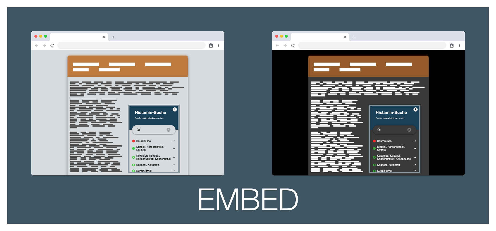

# Marketing

## Sources

All marketing screenshots have been made with Google Chrome Developer Tools - `Run Command` - `Capture Full Size Screenshot`.

All marketing mocks have been made using [Shotsnapp](https://app.shotsnapp.com/).
